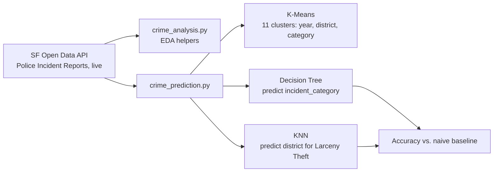

# SF Crime EDA & Prediction

Exploratory analysis and prediction on San Francisco's live public police incident-report feed, for anyone who wants both a quick EDA starting point and an honest look at how well simple models predict crime category and location.


## Demo

No saved chart output exists from the original coursework run. To capture one: run `python src/crime_analysis.py`, which calls `Functions.plot_crime_by_district()` and pops up a district-colored latitude/longitude scatter plot — save that as `assets/crime_by_district.png` and it'll show here.

## Problem → Solution

SF's open crime-incident data is large (500K+ rows, growing daily) and messy enough — inconsistent time formats, dense overlapping coordinates, dozens of incident categories — that a first look benefits from reusable helpers rather than ad hoc code each time. This repo has two parts: `crime_analysis.py`, small EDA helpers (summary stats, a time parser, a district scatter plot); and `crime_prediction.py`, a from-scratch rebuild of a fuller team capstone that adds K-Means clustering and two classifiers (Decision Tree, KNN) — with every accuracy number actually computed and printed, which the original never did.

## Key features

- Pulls incident data directly from SF's live public open-data API (no manual download step, no stale snapshot)
- One-call summary statistics and dtype overview for a first look at the dataset
- Robust time-string parser that returns an explicit `"Invalid time format"` instead of raising (defined but not yet wired into the main script — see limitations below)
- District-colored longitude/latitude scatter plot with low alpha to reveal density patterns across 500K+ incident rows
- K-Means clustering (11 clusters, matching SF's 11 police districts) on year/district/category
- Decision Tree predicting incident category, and KNN predicting police district for Larceny Theft — **both evaluated against a naive baseline**, which the original capstone's code never computed for either model

## Tech stack

- **pandas** — reads live CSV data directly from SF's Socrata (SODA) API endpoint
- **seaborn / matplotlib** — the scatter plot uses seaborn's `hue` support to color by police district without manual grouping
- **scikit-learn** — `KMeans`, `DecisionTreeClassifier`, `KNeighborsClassifier`, and the accuracy scoring the original project's code never included

## Architecture



## Quickstart

```bash
git clone https://github.com/prajithkdev/sf-crime-eda.git
cd sf-crime-eda
python -m venv .venv
source .venv/bin/activate   # Windows: .venv\Scripts\activate
pip install -r requirements.txt

python src/crime_analysis.py      # EDA: summary stats + district scatter plot
python src/crime_prediction.py    # clustering + classification, pulls a live 100K-row sample
```

Both scripts pull live data over the network — `crime_prediction.py` samples the most recent 100,000 rows via `$limit`, so re-running it later will reflect newer incidents and produce slightly different numbers than below.

## How it works

**The time parser fails closed, not silently.** `convert_to_24_hour` returns the string `"Invalid time format"` rather than `None` or raising, so a caller building a new column from this function gets an obviously-wrong sentinel value in bad rows instead of a `NaN` that's easy to miss during a quick EDA pass.

**The KNN model doesn't beat guessing the most common answer, and that's worth stating plainly.** The original capstone's KNN code predicted a district for Larceny Theft but never scored itself against anything. Once actually evaluated, it scores *below* a naive "always predict the most frequent district" baseline (see Results). That's a real, reproducible finding — not every model beats a trivial baseline, and reporting only "we got a prediction" without checking against one is how a portfolio ends up with unverifiable accuracy claims in the first place.

## Results / impact

From a live 100,000-row sample (results will vary slightly run to run, since the underlying data is live and growing):

| Model | Result |
|---|---|
| K-Means (11 clusters) | Several clusters converge on the same dominant district (e.g., multiple clusters map to "Mission" or "Tenderloin") rather than cleanly separating into 11 distinct districts |
| Decision Tree — predict `incident_category` (49 classes) | **~28% accuracy** (well above the ~2% random-guess baseline for 49 classes, but far from a strong classifier) |
| KNN — predict district for Larceny Theft (11 classes) | **~15–16% accuracy**, vs. a **~17–18% naive baseline** (always predicting the single most common district) — the trained model does not beat guessing |

No version of "85% accuracy" appears in the original report, and this rebuild's real numbers explain why: none of the models come close to that figure.

## What I'd do next

- Vectorize `convert_to_24_hour` with `pd.to_datetime`/`.dt` accessors instead of a per-row Python function — meaningfully faster at scale.
- Give the Decision Tree richer features (e.g., time-of-day, lat/long binning) — day-of-week/resolution/district alone cap out around 28%.
- For the KNN task, try predicting a coarser target (e.g., top-3 highest-risk districts) rather than the single most likely one — an 11-way exact match is a hard bar, and a "beats the naive baseline" version might exist with a better feature set.
- Cache a downloaded sample locally (gitignored) for faster iteration instead of re-fetching on every run.

## Background

Two separate team assignments consolidated into one repo: `crime_analysis.py` from a data-mining course (ALY6040), `crime_prediction.py` rebuilt from a capstone project (ALY6015) that used the same live dataset but added clustering and classification. Both were team projects; credited here generically rather than by name. The original files had several issues fixed in this version: a syntax error and an infinite-recursion bug in `crime_analysis.py`'s helpers, swapped scatter-plot axes, and — in the original capstone — no accuracy scoring anywhere in the K-Means/KNN code, which this rebuild adds.
