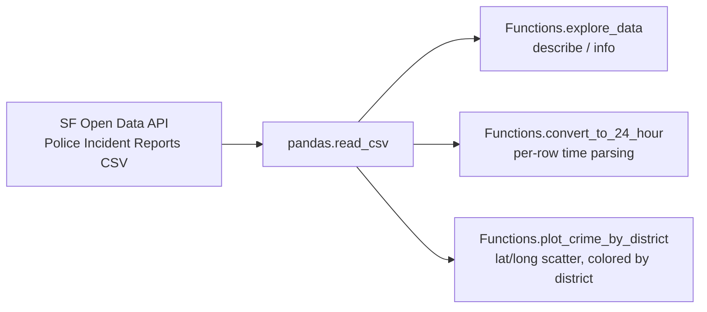

# SF Crime EDA

A small exploratory-analysis toolkit for San Francisco's public police incident-report dataset, for anyone who wants a quick starting point for geo-based crime EDA (district-level scatter plots, time-of-day parsing).


## Demo

No saved chart output exists from the original coursework run. To capture one: run `python src/crime_analysis.py`, which calls `Functions.plot_crime_by_district()` and pops up a district-colored latitude/longitude scatter plot — save that as `assets/crime_by_district.png` and it'll show here.

## Problem → Solution

SF's open crime-incident data is large (500K+ rows) and messy enough (inconsistent time formats, dense overlapping coordinates) that a first look benefits from a few reusable helpers rather than ad hoc code each time. This is a small team assignment from a data-mining course, kept here as three focused helpers: a quick `.describe()`/`.info()` pass, a 12-hour-to-24-hour time parser, and a district-colored scatter plot of incident locations.

## Key features

- Pulls incident data directly from SF's public open-data API (no manual download step)
- One-call summary statistics and dtype overview for a first look at the dataset
- Robust time-string parser that returns an explicit `"Invalid time format"` instead of raising, so malformed rows don't crash a larger pipeline
- District-colored lat/long scatter plot with low alpha to reveal density patterns across ~500K+ incident rows

## Tech stack

- **pandas** — reads the CSV directly from SF's Socrata API endpoint
- **seaborn / matplotlib** — the scatter plot uses seaborn's `hue` support to color by police district without manual grouping

## Architecture



## Quickstart

```bash
git clone https://github.com/prajithkdev/sf-crime-eda.git
cd sf-crime-eda
python -m venv .venv
source .venv/bin/activate   # Windows: .venv\Scripts\activate
pip install -r requirements.txt
python src/crime_analysis.py
```

The dataset is ~500K rows pulled live over the network — the initial `read_csv` call can take a while.

## How it works

**The time parser fails closed, not silently.** `convert_to_24_hour` returns the string `"Invalid time format"` rather than `None` or raising, so a caller building a new column from this function gets an obviously-wrong sentinel value in bad rows instead of a `NaN` that's easy to miss during a quick EDA pass.

**Low alpha instead of downsampling.** With 500K+ overlapping points, the district scatter plot uses `alpha=0.01` rather than sampling the data down — every point is still plotted, but density differences between districts become visible as color intensity instead of individual points being distinguishable.

## Results / impact

No metrics apply here — there's no model, only exploratory helpers. No saved output from an original run was available to report.

## What I'd do next

- Vectorize `convert_to_24_hour` with `pd.to_datetime`/`.dt` accessors instead of a per-row Python function — meaningfully faster at 500K+ rows.
- Cache the downloaded CSV locally (with a `.gitignore`'d `data/` folder) so repeat runs don't re-fetch ~500K rows over the network.
- Add a district-level incident-count bar chart alongside the scatter plot — the scatter shows spatial density but not per-district totals.

## Background

Developed as a team project for a data-mining coursework assignment (ALY6040) at Northeastern University. The original file had a syntax error (a malformed `try`/`except` in the time-parsing function) and an infinite-recursion bug in the exploration helper; both are fixed here so the code actually runs — everything else is unchanged from the original.
